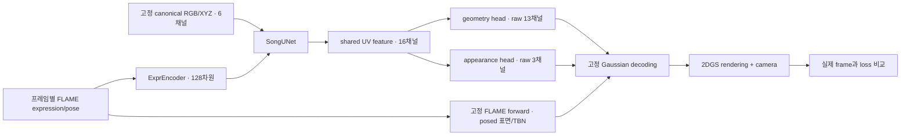

# ELITE: 한 사람의 실제 영상으로 학습하는 Gaussian Avatar

목표는 영상 한 개의 여러 frame을 사용해 **UV network를 실제로 학습하고**, 그 출력으로
표정과 pose에 따라 움직이는 2D Gaussian Avatar를 만드는 것이다. 각 단계에서 실제 다음
단계로 넘길 데이터를 만든다. 마지막에는 입력 영상과 렌더링을 나란히 보고 평가한다.

한 개의 영상은 한 장의 이미지가 아니다. 여러 표정, 시점, 눈/턱 움직임을 관측한 sequence다.
이번 데이터는 한 identity이며, avatar network가 새 identity에 일반화하는 것은 별도 목표다.
관측하지 않은 뒷머리와 새로운 표정의 품질은 입력 영상의 관측 범위에도 영향을 받는다.

## 이번에 만든 파일과 진행 순서

현재 **01~10의 코드가 모두 작성되어 있다.** 03~10은 아래의 순서로 실행하며 읽는다.
코드와 정적 검증에 더해 06의 공식 network 비교, 08의 짧은 학습/resume, 09의 영상/UV
저장과 10의 일부 frame 평가까지 GPU 2번에서 확인했다. 전체 학습의 수렴과 최종 품질은
별도로 확인한다.

| 순서 | 내용 | 실제 결과물과 확인할 것 |
|---|---|---|
| 01 | 영상 frame 추출과 RVM foreground matting | 연속 RGB frame, 실제 soft alpha, manifest, preview |
| 02 | ELITE가 고정한 VHAP 버전의 FLAME tracking | landmark/photometric fitting, static offset, 카메라, frame별 parameter, mesh overlay |
| 03 | Tracking 결과를 ELITE 입력으로 연결 | parameter의 역할, FLAME forward 코드 읽기, frame ID·camera·RGB 정합 |
| 04 | Canonical geometry/texture UV와 표면 대응 | 실제 texture, XYZ, face index, barycentric, valid mask, TBN, UV seam |
| 05 | Gaussian parameter map과 실제 2DGS rendering | local offset, 두 축 scale, quaternion, opacity, RGB를 decoded surface에 배치 |
| 06 | Mesh2Gaussian network | driving encoder, multiscale U-Net, skip connection, conditioning, attention, geometry/appearance heads |
| 07 | 학습 dataset와 loss | frame sampling, head mask, L1·LPIPS, alpha, normal consistency, depth distortion, UV regularization |
| 08 | 실제 network 학습 | backpropagation, optimizer, LR schedule, gradient 기록, checkpoint/resume, train/validation 분리 |
| 09 | Sequence rendering과 다른 driving signal | reference RGB, render, error, alpha, depth, normal, UV maps, animation |
| 10 | 최종 품질 확인과 개선 | seen/held-out 평가, PSNR/SSIM/LPIPS, 머리카락·입·눈·옆얼굴·시간적 안정성 검사 |

학습과 rendering 코드는 해당 단계에서 직접 읽을 수 있게 작성한다. 이후 동일한 계산을
반복해서 사용할 때만 필요한 최소 모듈로 묶는다. 숫자를 만든 뒤 결과처럼 보여주는
synthetic 대체 입력을 실제 영상 실험에 섞지 않는다.

## 학습의 집중 범위

01과 02는 검증된 전처리와 tracking 도구를 이용한다. 02의 실행 구조는 유지하고,
VHAP 원본에서 parameter가 어디서 만들어지고 어떻게 최적화되는지 찾아보며 이해한다.
FLAME은 학습된 parametric head model이고 VHAP은 영상에 그 모델을 fitting하는 도구다.
여기서는 기존 모델을 기반으로 삼되, 둘을 같은 foundation network로 부르지는 않는다.

02에서 읽을 원본 코드는 `external/vhap/vhap/model/tracker.py`의
`init_params`, `forward_flame`, `compute_lmk_energy`, `compute_photometric_energy`,
`optimize_iter`와 `external/vhap/vhap/model/flame.py`의 `FlameHead.forward`다.
Tracking 도구 자체를 재구현하는 대신, 공유 shape/static offset과 frame별 expression/pose,
camera convention, 저장되는 결과가 다음 단계에 어떤 의미를 갖는지 확인한다.

03은 tracking과 avatar 학습 사이의 연결 단계다. 전체 LBS를 처음부터 다시 구현하는
수업으로 확장하지 않고, 실제 frame의 mesh와 projection을 확인한 뒤 04로 넘어간다.

**직접 계산을 풀어 쓰는 학습은 04부터 시작한다.** 04의 UV 대응, barycentric 보간과 TBN,
05의 Gaussian decoding, 06의 conditioning network, 07~08의 loss와 gradient 흐름을
각 lesson에서 읽고 수정할 수 있게 작성한다. 특히 06은 network의 입력·출력 shape,
driving signal의 주입 위치, geometry/appearance의 예측 경로를 자세히 다룬다.
UV map, TBN, U-Net, 2DGS 각각을 ELITE만의 새로운 발명으로 설명하지 않는다.
기존 기술을 ELITE가 어떤 표현과 연결 방식으로 사용하는지 구분해 공부한다.

04 이후에는 각 계산에 대해 목적, 식, tensor shape, 구현, 실제 데이터 시각화를 연결한다.
최종 학습 loop에는 network forward, Gaussian decoding, rendering, 개별 loss,
`backward()`와 `optimizer.step()`을 명시한다. Renderer의 CUDA kernel처럼 외부 backend를
이용하는 부분은 입력·출력과 미분 경계를 설명한다. 한 사람으로 학습하는 이번 설정과
논문의 여러 identity를 이용한 prior 학습의 차이도 구분한다.

## 표현과 network에서 구현할 항목

ELITE의 공개 구현을 읽고 다음 계산을 04~08의 graph에 포함했다. 06은 공식 learned
network의 연산, 초기화, module 이름과 weight normalization을 그대로 옮겼다. 임의의
scale bias/output gain을 추가하지 않는다. Weight는 처음부터 초기화하고 한 사람으로
학습하므로 다인물 pretrained prior를 재현한 것은 아니다. 전처리/고정 decoding/loss의
차이는 아래 '공개 구현과 이번 학습의 차이'를 읽는다.

```text
Video -> RGB + alpha -> VHAP/FLAME tracking
                            |
            +---------------+----------------+
            |                                |
   개인의 canonical UV                 frame별 driving
   texture RGB + geometry XYZ         expression, jaw, eyes,
            |                         neck, global pose/translation
            |                                |
         UV encoder                    Driving encoder
            +-------------------------------+
                            |
              Multiscale conditioned U-Net
                            |
               Geometry / Appearance heads
                            |
               UV-aligned Gaussian parameters
                            |
              Posed FLAME surface + TBN frame
                            |
                 Differentiable 2DGS renderer
                            |
              RGB / alpha / normal / distortion
                            |
              실제 영상 supervision -> backward
```

### UV 입력과 FLAME 기준

- Texture 3채널과 canonical geometry XYZ 3채널을 사용한다. RGB/XYZ의 범위와 normalization을
  기록하고 동일한 값으로 inference한다. XYZ가 색이나 depth로 바뀌지 않는다.
- 개인 identity의 shape와 static offset을 포함하는 **encoding mesh**와, Gaussian을 배치할
  **posed base mesh**를 구분한다. 공식 `process_enc_flame`은 개인의 shape/static offset을
  반영하며 표정과 pose를 0으로 만든다. 원본 함수는 FLAME forward의 두 번째 반환값인
  **LBS 이전 `v_shaped`**를 선택한다. `zero_centered_at_root_node=True`는 첫 반환값에
  적용되므로 encoding XYZ를 root-centered posed vertices로 바꾸면 원본과 달라진다.
  `process_flame`의 기본값은 shape=0인 base에 해당
  frame의 expression/pose를 적용한다. 이 차이를 구현할 때 숨기지 않는다.
- FLAME의 전체 pose corrective, joint regression, LBS와 jaw/eye/neck articulation을 사용한다.
  이전 canonical lesson의 expression basis 하나와 global rotation만으로 대체하지 않는다.
- Teeth가 추가된 topology와 UV도 확인한다. 이전 lesson의 canonical NPZ는 full FLAME의
  모든 배열을 제공하지 않으므로 원본 모델과 matching UV/landmark/mask 자산을 사용한다.
- Rasterization lookup은 고정해도 posed XYZ와 TBN은 frame에 따라 다시 계산한다. UV 방향,
  pixel center, valid mask, seam, barycentric corner 순서까지 명시한다.

### Gaussian 표현

공개 `3d_prior.yaml`에서 `learn_stoffset=true`, `learn_quat=true`, `learn_opacity=true`다.
이 설정의 network 출력은 논문에서 단순화해 설명한 13채널에 fine offset 3채널을 더한
**16채널**이다. 최종 출력은 아래 정보를 모두 포함한다.

| 정보 | 채널 | decoding에서 하는 일 |
|---|---:|---|
| RGB | 3 | 유효 범위로 변환해 렌더링에 전달 |
| Coarse local displacement | 3 | 기본 형태의 위치 보정 |
| Fine local displacement | 3 | coarse와 더해 실제 local displacement 구성 |
| Scale | 2 | 2D surface Gaussian의 양의 두 축 크기 |
| Rotation | 4 | quaternion normalization과 TBN rotation 조합 |
| Opacity | 1 | sigmoid와 valid mask |

Gaussian 중심은

\[
\mathbf{x}_g(u,v;\Theta)
=\mathbf{P}_{\mathrm{posed}}(u,v;\Theta)
+\mathbf{R}_{\mathrm{TBN}}(u,v;\Theta)\mathbf{d}_{\mathrm{local}}(u,v;\Theta)
\]

로 계산한다. Quaternion의 `xyzw/wxyz` 순서와 renderer의 camera matrix convention은
실제 예측값과 projection을 비교해 확인한다. UV resolution과 출력 이미지 resolution은
서로 다른 설정이다. 2DGS는 3D 공간의 표면 Gaussian이며, 점 cloud scatter로 렌더링을
대체하지 않는다. Renderer는 실제 differentiable splatting backend를 사용한다.

### 학습

- 한 영상의 실제 RGB와 alpha를 사용해 network parameter를 업데이트한다. Neural network를
  통과시켜 그림만 그리거나, 학습된 것처럼 고정 map을 저장하는 것으로 종료하지 않는다.
- Driving encoder와 multiscale conditioned U-Net, geometry/appearance heads를 구현한다.
  공개 구조의 self-attention과 여러 resolution의 conditioning도 포함한다.
- 이번 구현은 `scratch`다. Driving encoder, conditioned U-Net, 두 refinement head가 모두
  trainable이다. 공개 MGPM 초기화 경로는 포함하지 않았다. 공개 checkpoint를 쓰려면
  원본 state_dict와 layer/normalization을 맞추는 별도 구현이 필요하다.
- Train/validation frame ID를 저장하고 시간적으로 가까운 frame의 leakage를 살핀다.
  모든 frame fitting 결과와 held-out 결과를 구분해 보고한다. 영상 전체로 수행한 tracking을
  공유한다면 held-out Gaussian RGB 평가를 완전히 독립적인 reconstruction 평가로 부르지 않는다.
- RGB/LPIPS와 alpha loss, normal consistency와 depth distortion, displacement/color의
  regularization을 구현한다. 손실별 값과 network로 돌아가는 gradient를 확인한다.
- Optimizer, scheduler, random state, normalization, split, camera/UV conventions를
  checkpoint에 함께 기록한다. 오류가 있는 tracking/alpha를 network가 덮어쓰도록 방치하지 않는다.
- 이번에는 diffusion enhancer와 생성 supervision을 포함하지 않는다.

높은 품질은 최종 결과로 확인한다. 첫 lesson을 만들었다는 이유로 완성된 고품질 avatar나
논문 성능이 재현됐다고 주장하지 않는다. 실제 품질은 후속 학습·rendering 결과로 판단한다.

## 폴더와 환경

모든 새 입력/출력은 이 폴더 아래 둔다. `.gitignore`가 데이터와 cache를 제외한다.

```text
lessons/elite/
  GUIDE.md
  01_prepare_video.py
  02_track_flame.py
  03_inspect_tracking.py
  04_build_canonical_uv.py
  05_decode_gaussians.py
  06_mesh2gaussian_network.py
  07_dataset_and_losses.py
  08_train_avatar.py
  09_render_animation.py
  10_evaluate_avatar.py
  avatar_config.json
  requirements_tracking.txt
  requirements_avatar.txt
  data/
    input.mp4                         # 사용자가 지정할 실제 영상
    sequences/person/
      images/000000.jpg ...           # VHAP 형식의 연속 frame
      alpha_maps/000000.png ...       # 학습용 lossless soft alpha
      alpha_maps/000000.jpg ...       # 고정 VHAP fork와의 호환용
      manifest.json
  outputs/01/person/preview.jpg
  outputs/02/person/full/             # tracking run과 진단
  external/vhap/                     # ELITE에 고정된 원본 tracker, Git 제외
  .cache/torch/hub/                    # RVM 코드/가중치 cache
```

사용자가 활성화한 Conda 환경(`curious` 또는 `elite`)을 사용한다.
Venv나 repo package 설치는 만들지 않는다.
01의 frame 추출에는 `numpy`, `Pillow`, FFmpeg/FFprobe 실행 파일이 필요하다.
FFmpeg의 help를 확인해 최신 버전에서는 `-fps_mode passthrough`, 구버전에서는
`-vsync 0`을 사용한다. FPS resampling은 별도의 `fps` filter가 담당한다.
Matting에는 CUDA 지원 `torch`와 그 버전에 맞는 `torchvision`이 추가로 필요하다.
FFmpeg가 없는 경우 사용자가 현재 환경에서 준비할 수 있다.

```bash
conda install -c conda-forge ffmpeg
```

이 명령과 아래 lesson은 사용자가 실행한다. Agent가 환경 설치나 GPU 실행을 수행하지 않는다.
후속 tracking·renderer dependency는 해당 lesson에서 version과 역할을 확인해 추가한다.

### H200에서 CUDA kernel 오류가 나는 경우

H200의 compute capability는 `sm_90`이다. GPU가 보이더라도 설치된 PyTorch 빌드가
실행 가능한 kernel을 제공하지 않으면 `no kernel image is available` 오류가 발생한다.
01은 모델을 다운로드/로드하기 전에 작은 CUDA 연산으로 실행 가능 여부를 확인한다.

Matting용 설치 조합의 예는 PyTorch 2.5.1 / torchvision 0.20.1 / CUDA 12.4 wheel이다.
CUDA 12.4 runtime을 지원하는 NVIDIA driver가 전제다. 아래는 사용자가 현재 환경에서
실행하는 명령이며, system CUDA toolkit을 설치하거나 바꾸는 명령은 아니다.

```bash
python -m pip install --upgrade torch==2.5.1 torchvision==0.20.1 --index-url https://download.pytorch.org/whl/cu124
```

이 조합은 01의 전처리를 위한 선택이다. 이미 설치한 PyTorch3D/CUDA renderer 등
compiled extension은 PyTorch 교체 후 새 버전에 맞게 다시 설치/빌드해야 할 수 있다.
후속 lesson 전체의 dependency 검증이 완료됐다는 뜻은 아니다.

기존 RGB frame과 RVM weight cache를 그대로 사용해 `--stage matting`을 다시 실행한다.
`CUDA_VISIBLE_DEVICES=2`이면 코드의 `cuda:0`은 노출된 물리 GPU 2를 가리킨다.

참고: [PyTorch 공식 설치 조합](https://pytorch.org/get-started/previous-versions/#v251),
[NVIDIA Hopper 호환성 설명](https://docs.nvidia.com/cuda/hopper-compatibility-guide/index.html).

## 01 진행 방법

다른 위치의 영상을 읽어도 산출물은 이 폴더에 저장한다. `--video`를 생략하면
`lessons/elite/data/input.mp4`를 사용한다.

먼저 CPU로 frame 추출을 진행한다.

```bash
python lessons/elite/01_prepare_video.py --video /실제/영상.mp4 --sequence person --stage frames
```

그다음 물리 GPU 2에서 RVM alpha를 만든다. 앞에서 만든 frame을 그대로 사용한다.

```bash
CUDA_DEVICE_ORDER=PCI_BUS_ID CUDA_VISIBLE_DEVICES=2 python lessons/elite/01_prepare_video.py --sequence person --stage matting
```

첫 실행에서 RVM의 고정 commit 코드와 공식 pretrained weight를 다운로드한다.
RVM은 foreground 전처리에만 쓰는 frozen 모델이다. Single-step diffusion enhancer는 아니다.

`--stage all`은 두 단계를 연속 실행한다. 읽을 때는 분리해서 RGB와 alpha를 각각 관찰한다.
기본은 최대 변 1024, 최대 25 FPS, 영상 전체이며 크기를 늘리거나 square crop하지 않는다.
원본 해상도를 유지하려면 `--max-side 0`, FPS를 지정하려면 `--fps 25`를 사용한다.
기존 sequence의 frame을 다시 만드는 경우 새 `--sequence` 이름을 지정한다.

### 이 단계에서 확인할 것

1. `manifest.json`의 실제 frame 수, 처리한 이미지 크기, FPS, 원본 SHA256을 읽는다.
   `sequence_time_s`는 resample된 sequence의 시간이며 원본 VFR source PTS와 동일하다고
   가정하지 않는다. 사진의 camera intrinsics는 후속 tracking에서 이 이미지 크기를 기준으로 얻는다.
2. `preview.jpg`에서 머리카락, 귀, 목, 안경 등의 foreground 경계를 본다.
   Alpha는 0/1 mask가 아닌 [0,1]의 soft 값이다. PNG의 8-bit 값을 255로 나눠 사용한다.
3. RVM은 full-person foreground를 만들므로 torso가 포함될 수 있다. Head/neck training 영역은
   tracking과 export 뒤에 정한다. RVM alpha를 곧바로 head-only mask라고 부르지 않는다.
4. 코드의 `recurrent_state`가 frame 간 전달되고 첫 frame warmup이 적용되는 이유를 설명한다.
5. RGB/alpha의 frame 번호와 크기가 일치하는지 본다. Scene cut, 다른 사람, 큰 가림이 있는
   영상은 먼저 한 사람의 연속된 구간으로 준비한다. HDR 영상은 명시적 SDR 변환을 준비한다.

완료 기준은 `manifest.json`의 `status=matting_ready`, 일치하는 RGB/alpha frame 목록,
사람의 경계가 맞는 preview다. 다음 lesson에서 이 sequence를 실제 FLAME tracker에 입력한다.

## 02: 실제 FLAME tracking

이번 입력은 `data/sequences/person`에 준비된 479개 frame, 702×1024 RGB/alpha다.
NeRSemble `042/FREE/cam_222200037.mp4`에서 얻은 **카메라 한 개의 sequence**를
monocular tracker로 fitting한다. 원본 NeRSemble의 calibration이나 제공 tracking은 이
경로에서 사용하지 않는다. 여러 카메라를 이용한 fitting은 별도 입력 경로다.

01에서 73 FPS 영상을 25 FPS로 resample했으므로, 원본 frame 번호의 제공 tracking을
그대로 대응시키면 안 된다. 여기서는 준비된 479개 frame에 대해 새로 tracking한다.

### 여기서 배우는 계산

Fitting은 실제 관측 RGB와 landmark에 맞는 FLAME parameter를 찾는 과정이다.

\[
\min_{\beta,\psi_t,\theta_t,\mathbf{t}_t,\Delta V, f, T, L}
\lambda_{lmk}E_{lmk}+\lambda_{rgb}E_{rgb}
+E_{parameter}+E_{temporal}+E_{offset}+E_{texture}
\]

- `beta/shape`: 한 사람의 identity, frame 전체에서 공유한다.
- `psi_t/expr`: frame별 표정 coefficient다.
- `theta_t`: head/neck/jaw/eyes의 axis-angle rotation이며 단위는 radian이다.
- `translation`: 움직이는 head의 world translation이다. Camera extrinsic과 구분한다.
- `static_offset`: canonical mesh의 개인별 XYZ 보정이며 frame 전체에서 공유한다.
- `f`, `T`, `L`: focal length, texture, SH lighting이다. RGB 정합에서도 같이 최적화한다.

원본의 full FLAME/LBS, teeth, landmark loss, photometric loss, temporal/shape/offset/texture
regularization과 Adam을 사용한다. Gaussian network를 학습하는 단계는 이후 06–08이다.

`tracking_config`에 초기화와 refinement 설정을 드러내 두었다. 기본은 rigid landmark 초기화,
shape/표정 초기화, texture/RGB/static-offset 초기화, frame별 50 step photometric tracking,
마지막 30 epoch global refinement다. 원본의 초기화 단계들은 각 500 step이다.
이번 기본 `batch_size=1`은 frame별 정합을 확인하기 위한 원래 tracking 동작이다.
빠른 batch fitting을 시도하면 `--batch-size 16 --run batch16`으로 결과를 구분한다.

### 실행 준비: 사용자 환경에서 한 번

아래 명령은 **repo root가 아니라 `lessons/elite`에서 실행하는 예시**다.
현재 활성화한 `elite` 또는 `curious` Conda 환경을 사용한다. 새 환경은 만들지 않는다.

```bash
cd /media/vilab/mh/curious/lessons/elite
python 02_track_flame.py --stage prepare
```

이 단계가 실제 VHAP의 고정 commit을 `external/vhap`에 받고, 아래 원본을 symlink로 연결한다.

```text
FLAME2023/flame2023.pkl  -> external/vhap/asset/flame/flame2023.pkl
FLAME2023/FLAME_masks.pkl -> external/vhap/asset/flame/FLAME_masks.pkl
```

경로가 다르면 `--flame-model`, `--flame-masks`로 지정한다. UV template, landmark embedding,
painted texture, UV mask는 VHAP에 포함된 matching 자산을 사용한다. 라이선스 모델은
사용자가 보유한 파일만 연결한다. 기존 canonical lesson의 OBJ/NPZ로 대체하지 않는다.

VHAP의 `pip install -e .`는 NumPy 1.22.3과 GUI/background-matting dependency까지 설치한다.
여기서는 필요한 dependency를 아래처럼 명시하고, VHAP Python 코드는 checkout에서 직접
import한다. `requirements_tracking.txt`는 **Python 3.10용 설치 후보 조합**이며, 이 머신에서
GPU 실행 검증을 완료한 lockfile은 아니다. 이미 H200에서 작동하는 torch/torchvision을 유지한다.
이 폴더의 기존 `req.txt`에는 torch=2.0.1, torchvision=0.15.2가 고정되어 있다.
그 파일을 다시 설치하면 현재 H200에서 확인한 조합이 바뀔 수 있으므로, 이번 02에서는
torch를 포함하지 않는 `requirements_tracking.txt`로 필요한 dependency를 준비한다.

```bash
python -m pip install wheel ninja cmake==3.30.5
python -m pip install -r requirements_tracking.txt
python -m pip install --no-build-isolation chumpy==0.70
python -m pip install --no-deps git+https://github.com/ShenhanQian/STAR.git@be3c8605efb03849c23093f12b9bb87908a7a4d6
```

NumPy 1.23.5는 chumpy와 STAR/imgaug의 구형 NumPy API를 위한 선택이다.
STAR는 원본과 같은 실제 pretrained landmark network다. Check/landmark 단계에서 공식
predictor와 network weight를 `lessons/elite/.cache/STAR`에 다운로드한다. Network 계산은
수정하지 않으며, import 시 제공하는 asset 경로만 local cache로 연결한다.

PyTorch3D와 nvdiffrast는 기존 torch와 맞아야 한다. 설치가 없거나 PyTorch 교체 후 깨졌다면
활성 환경의 torch에 맞춰 source build한다. 사용자가 설치한 `nvcc`/C++ compiler가 필요하다.
`nvidia-smi`의 CUDA Version은 driver 지원 범위이며, 설치된 toolkit version은 `nvcc --version`으로
확인한다. 예를 들어 torch의 `torch.version.cuda=12.4`라면 맞는 CUDA 12.4 toolkit과 `CUDA_HOME`을
준비한다. CUDA wheel을 설치하는 것만으로 `nvcc`가 설치되지는 않는다.

```bash
nvcc --version
# 필요한 경우 사용자가 실제 toolkit 경로로 지정한다.
# export CUDA_HOME=/usr/local/cuda-12.4

# 새로 설치/재빌드해야 하는 경우에만 실행한다.
MAX_JOBS=8 FORCE_CUDA=1 TORCH_CUDA_ARCH_LIST=9.0 python -m pip install --no-build-isolation --no-deps --force-reinstall git+https://github.com/facebookresearch/pytorch3d.git@33824be3cbc87a7dd1db0f6a9a9de9ac81b2d0ba
MAX_JOBS=8 python -m pip install --no-build-isolation --no-deps --force-reinstall git+https://github.com/ShenhanQian/nvdiffrast.git@22718580f24a313c429ba2c304794c264351f108
```

PyTorch3D는 v0.7.9, nvdiffrast는 VHAP이 지정하는 backface-culling fork의 commit이다.
위 command가 이 서버에서 성공했다는 의미는 아니다. 아래 `check`가 설치 상태를 실제로 검증한다.
Build 로그에 torch/CUDA/compiler 충돌이 있으면 그 조합을 먼저 맞춘다.

```bash
CUDA_VISIBLE_DEVICES=2 python 02_track_flame.py --stage check
```

`check`는 작은 실제 rasterization → interpolation → antialias → backward와
PyTorch3D Laplacian을 실행한다. 이어서 STAR import와 weight 경로를 확인한다.
전체 tracking은 실행하지 않는다. 처음에는 nvdiffrast extension을 compile할 수 있다.

### 순서대로 실행하고 확인하기

#### CUDA_HOME 오류

`RasterizeCudaContext()`에서 `CUDA_HOME environment variable is not set`이 발생하면
PyTorch가 NVDiffrast CUDA extension을 빌드할 toolkit root를 찾지 못한 것이다.
`torch.version.cuda=12.4`는 설치된 PyTorch의 CUDA runtime build를 뜻하며 `nvcc` 설치를
의미하지 않는다. Matting은 미리 빌드된 PyTorch 연산을 이용하지만 이 NVDiffrast fork는
처음 context를 만들 때 CUDA/C++ source를 JIT compile한다.

활성 `elite` 환경에서 먼저 확인한다.

```bash
command -v nvcc
nvcc --version
```

CUDA 12.4 toolkit을 이미 설치했다면 그 실제 root를 `CUDA_HOME`으로 지정한다.
`CUDA_HOME/bin/nvcc`가 존재해야 하며, 존재하지 않는 `/usr/local/cuda-12.4` 경로를 변수에
넣는 것만으로는 해결되지 않는다. Toolkit이 없다면 현재 Conda 환경에 준비할 수 있다.
사용자가 실행하는 NVIDIA CUDA 12.4.1 toolkit 설치 예시:

```bash
conda activate elite
conda install -n elite -c nvidia/label/cuda-12.4.1 cuda-toolkit=12.4.1
export CUDA_HOME="$CONDA_PREFIX"
export PATH="$CUDA_HOME/bin:$PATH"
export LD_LIBRARY_PATH="$CUDA_HOME/lib:$CUDA_HOME/targets/x86_64-linux/lib${LD_LIBRARY_PATH:+:$LD_LIBRARY_PATH}"
export TORCH_CUDA_ARCH_LIST=9.0
export MAX_JOBS=8
nvcc --version
```

이 설정은 현재 shell에 적용된다. Agent는 설치나 GPU 실행을 수행하지 않는다.
`nvcc --version`에 release 12.4가 표시된 뒤 새 Python process로 다시 실행한다.

```bash
CUDA_VISIBLE_DEVICES=0 python lessons/elite/02_track_flame.py --stage check
```

위 경로는 repo root에서 실행하는 예시다. `lessons/elite` 안에서는 `python 02_track_flame.py`를
사용한다. 현재 사용자가 선택한 GPU 0을 유지한 예시이며, GPU 2를 쓸 경우 노출 번호를 바꾼다.
이 오류만으로 PyTorch/NVDiffrast 재설치나 JIT cache 삭제를 할 필요는 없다.
Toolkit 연결 후 실제 compile에서 별도 오류가 나오면 해당 build log를 기준으로 확인한다.

참고: [PyTorch 2.5.1의 toolkit 경로 탐색](https://github.com/pytorch/pytorch/blob/v2.5.1/torch/utils/cpp_extension.py),
[NVIDIA Conda toolkit 설치](https://docs.nvidia.com/cuda/archive/12.4.1/cuda-installation-guide-linux/index.html#conda-installation).

#### CUDA 11.8을 선택하는 경우

ELITE 원본은 CUDA 11.8과 gcc/g++ 11에서 검증했다. CUDA 11.8은 Hopper sm_90 native
kernel을 만들 수 있다. 이번 lesson도 11.8로 구성할 수 있지만 현재 Torch가 `cu124`라면
toolkit만 교체하지 않는다. Torch runtime과 extension build toolkit을 함께 11.8로 맞춘다.
PyTorch version은 lesson의 API를 유지하도록 2.5.1을 사용하며 원본 전체 환경과 같다는
의미는 아니다. 다음은 사용자가 실행하는 절차다.

```bash
conda activate elite
conda install -n elite -c nvidia/label/cuda-11.8.0 cuda-toolkit=11.8.0
python -m pip install --upgrade torch==2.5.1+cu118 torchvision==0.20.1+cu118 --index-url https://download.pytorch.org/whl/cu118

export CUDA_HOME="$CONDA_PREFIX"
export PATH="$CUDA_HOME/bin:$PATH"
export LD_LIBRARY_PATH="$CUDA_HOME/lib:$CUDA_HOME/targets/x86_64-linux/lib${LD_LIBRARY_PATH:+:$LD_LIBRARY_PATH}"
export CC=/usr/bin/gcc-11
export CXX=/usr/bin/g++-11
export TORCH_CUDA_ARCH_LIST=9.0
export MAX_JOBS=8
nvcc --version
python -c 'import torch; print(torch.__version__, torch.version.cuda)'
```

`nvcc`는 release 11.8, Torch는 `2.5.1+cu118` / `11.8`이어야 한다. Local version suffix
`+cu118`를 명시한 것은 이미 설치된 동일 2.5.1의 `+cu124` build도 확실히 교체하기 위해서다.
Conda toolkit만 설치하는 과정에서는 PyTorch wheel이 자동으로 교체되지 않는다.

Torch/CUDA를 바꾼 뒤 compiled extension은 현재 조합에 맞춰 다시 빌드한다. 기존 binary가
pip wheel cache에서 재사용되지 않도록 `--no-cache-dir`를 사용한다. NumPy와 기존 dependency를
임의로 업그레이드하지 않도록 extension 설치에는 `--no-deps`를 유지한다.

```bash
MAX_JOBS=8 FORCE_CUDA=1 TORCH_CUDA_ARCH_LIST=9.0 python -m pip install --no-cache-dir --no-build-isolation --no-deps --force-reinstall git+https://github.com/facebookresearch/pytorch3d.git@33824be3cbc87a7dd1db0f6a9a9de9ac81b2d0ba
MAX_JOBS=8 python -m pip install --no-cache-dir --no-build-isolation --no-deps --force-reinstall git+https://github.com/ShenhanQian/nvdiffrast.git@22718580f24a313c429ba2c304794c264351f108
CUDA_VISIBLE_DEVICES=0 python lessons/elite/02_track_flame.py --stage check
```

위 실행 경로는 repo root 기준이다. 2DGS backend도 이미 설치했다면 새 Torch/CUDA 조합으로
05 dependency를 다시 빌드한다. 원본의 PyTorch 2.0.1용 PyTorch3D wheel을 이번 2.5.1에
사용하지 않는다. 실제 H200 kernel 실행과 backward는 `--stage check`로 확인한다.
Agent는 이 환경 교체/설치/build/GPU 실행을 수행하지 않는다.

참고: [ELITE 원본 환경](https://github.com/kaist-ami/ELITE#environment-setup),
[PyTorch 2.5.1 CUDA 11.8 build](https://pytorch.org/get-started/previous-versions/#v251),
[NVIDIA Hopper 호환성](https://docs.nvidia.com/cuda/hopper-compatibility-guide/index.html).

**1. 실제 landmark 검출**

```bash
CUDA_VISIBLE_DEVICES=2 python 02_track_flame.py --stage landmarks
```

STAR로 모든 frame의 68점을 검출하고 `data/sequences/person/landmark2d/STAR/0.npz`에
저장한다. Coordinates는 `(x/width, y/height, confidence)`이며 frame 번호도 함께 저장한다.
`outputs/02/person/landmarks_preview.jpg`에서 눈·입·얼굴 윤곽의 점을 확인한다.

검출 실패 frame을 목록에서 삭제하면 뒤쪽 frame 대응이 밀릴 수 있다. 이 코드는 실패 row도
진단 파일에 보관하고 fitting 전에 중단한다. `landmarks_report.json`에 실패 번호가 있다.
가림/얼굴 방향/영상 구간을 확인해서 입력을 준비한다. 실패한 점을 임의의 값으로 채우지 않는다.
첫 frame 이후의 검출 실패를 photometric/temporal fitting에 맡기려면 landmarks와 track 양쪽에
`--allow-missing-landmarks`를 명시한다. 실패 row는 좌표=-1, confidence=0으로 보관해 해당
frame의 landmark loss를 끈다. 결과 overlay에서 그 frame의 정합을 직접 확인해야 한다.
초기화하는 첫 frame은 이 옵션을 사용해도 검출점이 필요하다.

**2. 실제 photometric fitting**

```bash
CUDA_VISIBLE_DEVICES=2 python 02_track_flame.py --stage track
```

기본 run은 `full`이다. 완료하면 아래 자료가 생긴다.

```text
outputs/02/person/full/
  session.json                            # 상태, source revision, 입력/자산 SHA256, 설정
  tracking/<timestamp>/
    config.yml                            # 원본 VHAP 설정
    tracked_flame_params_30.npz            # 최종 실제 fitting parameter
    eval_30/image_grid/frame_*.jpg         # RGB/render/error/normal/alpha/landmark 진단
    events.out.tfevents.*                  # loss 기록
```

`LessonTracker`가 바꾸는 것은 logging뿐이다. 기본은 진단 grid와 parameter를 저장하고,
반복 OBJ/MTL/texture dump는 `--save-debug-meshes`로 선택한다. Loss와 최적화 계산은
원본 `GlobalTracker`를 상속한다. 중간 epoch NPZ를 최종 완료 결과로 자동 선택하지 않는다.
같은 run을 덮어쓰지 않으므로 다른 설정 또는 실패 후 재시도는 새 `--run` 이름을 사용한다.
후속 inspect/preview/export에도 같은 `--run`을 지정한다.

**3. Parameter를 직접 읽기 — CPU**

```bash
python 02_track_flame.py --stage inspect
```

`read_parameters`에서 NPZ를 열고 실제 배열의 shape, frame 순서, 유한한 값, 이미지 크기를
확인한다. `summary.json`에는 camera와 배열 정보, `parameter_curves.png`에는 표정/pose/이동
곡선과 static offset 분포가 생긴다. `expr`의 각 coefficient는 basis의 가중치다. 첫 coefficient가
곧바로 '웃음의 크기'라고 가정하지 않는다.

Monocular raw tracking에서 `focal_pixels = focal_length * max(height, width)`다.
Camera는 OpenGL `w2c`이며 z translation=-1, principal point는 이미지 중심이다.
이 카메라에서 움직이는 head의 global rotation/translation을 FLAME에 적용한다.
원본 NeRSemble의 calibrated world 좌표와 같은 것으로 해석하지 않는다.

**4. 실제 mesh overlay 확인**

```bash
CUDA_VISIBLE_DEVICES=2 python 02_track_flame.py --stage preview --preview-all
```

저장된 parameter를 full FLAME에 넣고, 원본과 같은 camera로 실제 mesh를 rasterize한다.
`mesh_preview.jpg`, 모든 frame의 `preview/*.jpg`, `mesh_overlay.mp4`를 확인한다.
`--preview-all`을 빼면 균등하게 선택한 8개 frame만 그린다.
같은 checkpoint의 preview는 다시 생성할 수 있다. Tracking parameter와 입력 영상은 바꾸지 않는다.

- 왼쪽은 원본 RGB, 가운데는 실제 mesh overlay, 오른쪽은 camera-space normal이다.
- 가운데 초록점은 STAR 검출점, 빨간점은 3D FLAME landmark를 camera로 projection한 점이다.
- 눈/입/턱 정합, 귀·머리 윤곽, 큰 회전에서의 drift, 시간에 따른 떨림을 본다.
- `projection_report.json`은 검출점과의 pixel 거리다. 3D ground-truth 오차로 해석하지 않는다.

### 선택: 원본 VHAP 형식으로 export

정합을 확인한 뒤 실제 VHAP export를 수행할 수 있다.

```bash
CUDA_VISIBLE_DEVICES=2 python 02_track_flame.py --stage export
```

`data/processed/person/full`에 실제 RGB/foreground mask, frame별 FLAME parameter,
canonical parameter, `transforms*.json`을 저장한다. FLAME의 neck/boundary point를 투영해
기울어진 기준선을 만들고 그 아래 영역을 RGB와 foreground mask에서 제거한다.
별도의 semantic head segmentation이 아니다. 이 fork의 export는 호환용 JPEG alpha를
사용하므로 원래 lossless PNG는 sequence에 보존하고, 이후 Gaussian supervision에서 구분한다.
공식 export는 평균 head translation으로 mesh를 recenter하고 camera `c2w`도 같이 바꾼다.
Raw tracking parameter와 export camera를 임의로 섞으면 정합이 틀어진다.
이번 03~10은 raw tracking space와 원래 PNG alpha를 직접 사용하므로 이 export는
필수가 아니다. `--stage track`와 overlay 확인을 완료하면 03으로 진행할 수 있다.

또한 VHAP export의 canonical parameter는 jaw=[0.3,0,0]인 open-mouth 기준이다.
ELITE의 encoding canonical처럼 expression/pose=0인 입력은 03–04에서 명시적으로 구성한다.
공식 monocular export의 validation camera set은 비어 있으므로, 이후 학습에서 temporal
train/validation split을 별도로 만든다.

02의 완료 기준은 정상 완료된 `session.json`, 모든 frame에 대응하는 최종 parameter,
실제 RGB와 정합된 mesh overlay다. Fitting이 끝났다는 이유만으로 정합 품질을 승인하지 않는다.

## 03~10의 추가 dependency

아래 명령은 **사용자가 현재 `elite` Conda 환경에서** 실행한다. 기존 Torch/torchvision과
tracking dependency가 준비되어 있다는 전제다. `req.txt` 전체를 다시 설치하지 않는다.

```bash
cd /media/vilab/mh/curious/lessons/elite
python -m pip install --no-deps -r requirements_avatar.txt
```

추가 Python package는 LPIPS다. 08/10에서 처음 사용할 때 VGG/LPIPS weight를 읽거나
다운로드한다. Torch hub cache는 `.cache/torch/`다. 학습된 VGG는 고정되지만 prediction으로
돌아가는 perceptual gradient는 유지된다.

05부터는 실제 `diff_surfel_rasterization` CUDA extension이 필요하다. 확인한 revision은
`e0ed0207b3e0669960cfad70852200a4a5847f61`이다. H200용 source build 예시:

```bash
MAX_JOBS=8 TORCH_CUDA_ARCH_LIST=9.0 python -m pip install --no-build-isolation --no-deps git+https://github.com/hbb1/diff-surfel-rasterization.git@e0ed0207b3e0669960cfad70852200a4a5847f61
```

이 명령은 agent가 실행하지 않았다. 현재 Torch build와 호환되는 `nvcc`, CUDA toolkit,
C++ compiler가 필요하다. `nvidia-smi`의 CUDA 표시는 toolkit 설치 여부를 의미하지 않는다.
현재 환경의 build 성공 여부는 사용자가 05의 실제 backward로 확인한다.

## 03: Tracking에서 무엇을 가져오는가

```bash
CUDA_VISIBLE_DEVICES=2 python 03_inspect_tracking.py
```

기본값은 `--sequence person --run full`이며 02에서 다른 이름을 썼다면 이후에도 동일하게
전달한다. 모든 frame의 image/PNG alpha hash와 FLAME asset을 기록한다.

- `FrameGeometry.forward`: FLAME에 실제로 넣는 모든 parameter가 보인다.
- `personal=True`: 개인 shape/static offset을 포함한 tracking mesh다. Projection과 texture
  observation에 사용한다.
- `neutral=True, shaped=True`: 개인 identity의 LBS 이전 `v_shaped`다. Encoding XYZ에 사용한다.
- 기본 `personal=False`: shape=0/offset 없음인 posed base mesh다. 05에서 Gaussian을 배치한다.
- `project`: OpenGL camera depth=-z, pixel x=fx*x/depth+cx, y=cy-fy*y/depth를 직접 계산한다.
- `head_keep_mask`: 목 하단 기준선 아래를 제거한다. RVM이 추출한 torso를 avatar target에서
  제외하며, 실제 mask는 RGB와 함께 07에서 확인한다.

`outputs/03/person/full/scene.pt`는 이후의 데이터 계약이다. `projection.jpg`의 녹색 점이
얼굴과 맞는지 먼저 본다. Train/validation은 연속 block으로 나누고 경계 근처 train frame을
제외한다. 현재 479 frame의 기본 split은 **train 337 / validation 96 / gap 46**이다.

## 04: UV pixel이 어떤 표면 위치를 뜻하는가

```bash
CUDA_VISIBLE_DEVICES=2 python 04_build_canonical_uv.py --uv-size 512
```

읽을 순서는 `uv_lookup`, `interpolate_vertices`, `face_tbn`, texture fusion loop다.
UV resolution은 출력 RGB 해상도와 독립적이다. `row=0`은 `v=1`, pixel center는
`((col+.5)/U, 1-(row+.5)/U)`로 통일한다.

CUDA rasterizer의 coverage 판정은 꼭짓점을 1/16 pixel 격자로 반올림한다. 그래서 경계에서
선택된 face와 원래 UV triangle의 내부 판정이 조금 다를 수 있다. `uv_lookup`은 float64로
barycentric을 직접 계산하고, 차이가 subpixel 범위인지 실제 pixel 거리로 검사한다.
원래 triangle 밖에 있는 center는 `valid=False`, `face=-1`, `bary=0`으로 제외한다.
얇은 triangle에서는 작은 위치 차이도 큰 음수 가중치가 될 수 있으므로 가중치의 절댓값만으로
오류를 판정하지 않는다. 제외된 texel 수는 실행 출력과 `summary.json`에서 확인할 수 있다.

`face[U,U]`와 `bary[U,U,3]`가 표면 대응을 정의한다. XYZ는 `sum(w_i * v_i)`로 만들며
같은 lookup을 frame별 posed mesh에 적용하면 posed XYZ가 된다. `face_tbn`은 UV triangle의
derivative로 tangent를 얻고 right-handed 회전 frame을 만든다. Face winding/UV mirror/
degenerate face를 코드에서 처리한다. Normal map은 이 frame의 세 번째 축이다.

Texture는 train RGB의 visibility-weighted fusion이다. 개인 mesh를 카메라로 projection해
RGB를 sample하되 z-buffer, alpha, 시선과 normal 각도를 검사한다. Texture는 조명이 포함된
관측 색이며 intrinsic albedo가 아니다. 전체 train 중 최대 128 frame을 균등하게 사용한다.
`--texture-frames 0`이면 모든 train frame을 사용한다.

`texture.png`, `xyz_visualization.png`, `normal.png`, `tangent.png`, `bitangent.png`, `coverage.png`, `valid.png`,
`face_index.png`를 비교한다. `coverage.png`의 빈 영역은 관측하지 못한 영역이다.
Nearest fill은 network 입력을 채우기 위한 것이며 confidence가 생긴 것으로 취급하지 않는다.
실제 XYZ/face/bary/normalization 값은 `uv.pt`에 저장된다. 시각화 RGB를 geometry로 쓰지 않는다.

## 05: UV map이 어떻게 실제 Gaussian이 되는가

```bash
CUDA_VISIBLE_DEVICES=2 python 05_decode_gaussians.py --frame 0 --check-backward
```

`SurfaceMap.decode`의 채널별 slicing과 다음 계산을 확인한다.

```text
geometry 13 = coarse xyz 3 + scale 2 + local quaternion 4 + fine xyz 3 + opacity 1
appearance 3 = RGB
local displacement = 0.2*tanh(coarse) + 0.1*tanh(fine)
world position = barycentric posed position + TBN @ local displacement
world rotation = TBN @ local rotation
```

Scale은 공개 구현의 positive bounded decoding 식을 사용한다. 첫 render의 scale logit은
UV resolution에 맞춰 초기화한다. Local quaternion은 xyzw, renderer 입력은 wxyz다.
Invalid UV pixel은 아예 Gaussian list에서 제외한다. 실제 backend가 RGB, alpha, normal,
median/expected depth, distortion을 계산한다.

05를 실행하면 `outputs/05/<sequence>/<run>/`에 Gaussian Map도 저장한다.
`000000_initial_uv_raw_channels.png`는 activation 전 geometry 13채널과 appearance 3채널을
따로 보여준다. `000000_initial_uv_decoded.png`는 실제 Gaussian RGB, world XYZ, 로컬 변위,
world normal, 두 축 scale, opacity, valid mask를 UV 격자에서 보여준다. Frame을 바꾸면
파일 이름의 숫자도 바뀐다. XYZ/변위/normal의 RGB는 좌표 시각화이며 실제 texture 색이 아니다.
초기 변위는 0이라 회색이고 scale은 일정하며 opacity는 0.5다. Raw opacity 값 0과
실제 opacity 0.5는 서로 다른 단계의 값이다. `000000_initial_uv_maps.pt`에는 raw Map,
decoded Map의 실제 수치, valid mask와 XYZ 표시용 정규화 범위를 저장한다.

`decode`에는 학습할 weight가 없다. Geometry/appearance Map을 입력받아 activation,
유효 texel 선택, 표면 위치와 TBN 변환을 수행하는 고정된 미분 가능 함수다. 05에서는
Map을 수동 초기화하고, 08에서는 network가 Map을 출력한다. Renderer의 loss gradient가
`decode`를 통과해 network로 전달되어 network weight가 학습된다.

이 단계의 이미지는 **학습 전 초기 상태**다. 개인 shape를 제거한 base 위에 offset=0을
놓았으므로 완성된 개인 avatar로 해석하지 않는다. `--check-backward`는 실제 frame의
RGB/alpha loss를 계산하고 geometry/appearance map까지 finite nonzero gradient가 돌아오는지
검사한다. `backward_check.json`에 채널별 gradient를 기록한다. GPU 호환성과 연결을 확인한
뒤 08로 간다.

## 06: Network를 입력에서 gradient까지 읽기

06의 목표는 **canonical 표면의 위치 대응을 유지하면서, 표정과 pose에 따라 Gaussian
parameter를 생성하는 학습 함수를 코드로 이해하는 것**이다. 단순히 U-Net의 layer 이름을
외우는 대신 입력의 의미, 중간 feature, 출력의 해석, loss의 역방향 경로를 연결한다.
아래에서 `B`는 batch size, `H=W=512`는 UV 해상도다. `[B,C,H,W]`의 마지막 두 축은
카메라 이미지의 pixel이 아니라 canonical UV texel이다.

### 06.1 먼저 전체 경로: 같은 사람, 다른 표정

한 사람에게 고정된 canonical 입력을 `X`, 프레임 t의 FLAME driving을 `p_t`라고 하자.
학습 가능한 파라미터를 θ, φ, ψ, ω로 나누면 계산은 다음과 같다.

```text
e_t = ExprEncoder_θ(p_t)                  [B,128]
F_t = SongUNet_φ(X, e_t)                 [B,16,512,512]
G_t = GeometryHead_ψ(F_t)                [B,13,512,512]
A_t = AppearanceHead_ω(F_t)              [B, 3,512,512]
```

`Mesh2Gaussian.forward`가 전체 입구이고 `GaussianMapDecoder.forward`가 뒤의 세 연산이다.
여기서 만든 `G_t`, `A_t`를 05의 `SurfaceMap.decode`가 posed 표면과 합쳐 실제 Gaussian
위치/scale/회전/opacity/RGB로 바꾼다. 렌더링과 loss는 07~08에 연결되어 있다.



입을 다문 frame과 벌린 frame을 비교할 때 `X`는 같다. `p_t`가 달라지면 `e_t`가 달라지고,
그 조건을 받은 network가 입 주변 Gaussian offset, 방향, 색 등을 다르게 만들 수 있다.
**동시에 FLAME 자체도 입을 움직인다.** 따라서 animation은 아래 두 경로의 합이다.

1. `p_t → FLAME forward → posed 표면`: 기존 FLAME이 제공하는 기본 deformation.
2. `p_t → ExprEncoder → UV network → Gaussian Map`: 관측에 맞춰 학습하는 추가 변화.

이 설명은 구현의 계산 경로를 해석한 것이다. 학습이 입 주변에만 완벽하게 국소화되거나
모든 새로운 표정에 일반화한다는 보장은 아니다. 학습 데이터와 objective가 그 동작을 결정한다.

### 06.2 입력 세 종류를 구분하기

| 입력 | Shape | 담는 정보 | 이번 학습에서 optimizer가 수정하는가 |
|---|---|---|---|
| Canonical RGB | `[B,3,512,512]` | train 관측으로 fusion한 identity의 색/질감, 입력 범위 `[-1,1]` | 아니오 |
| Canonical XYZ | `[B,3,512,512]` | 각 UV texel이 개인 encoding mesh의 어디에 대응하는지, normalization된 좌표 | 아니오 |
| Driving | expr `[B,100]`, rot/trans/neck/jaw 각각 `[B,3]`, eyes `[B,6]` | 프레임별 expression·전체 rigid transform·관절 회전 | 아니오 |

`SurfaceMap.uv_input`과 06의 `main`은 채널 축으로 RGB와 XYZ를 연결한다.

```text
X[:,0:3] = texture * 2 - 1
X[:,3:6] = normalized_xyz
X.shape  = [B,6,512,512]
```

XYZ는 displacement가 아니라 **입력 표면의 위치**다. RGB도 network가 예측한 appearance
map이 아니라 입력 texture다. 05에서 수동으로 초기화했던 geometry 13채널/appearance
3채널을 그대로 network 입력으로 넣는 구조가 아니다.

Canonical 입력은 03~04에서 만든 개인 encoding mesh에서 온다. Gaussian 배치용 posed
base는 `FrameGeometry.forward(personal=False)`를 사용해 shape/static offset을 제거하고
frame의 expression/pose를 적용한다. 그래서 입력 XYZ를 최종 Gaussian 중심으로 그대로
복사하는 것이 아니다. 개인 형상은 입력에 담겨 있고, network가 base 대비 residual로
이를 표현하도록 학습한다. 이 구분은 03과 05에서 읽었던 encoding/base의 구분과 같다.

`parameter_batch`는 저장된 tracking parameter에서 frame index를 선택할 뿐이다. 06이
RGB 영상에서 FLAME parameter를 새로 추정하는 것은 아니다. 카메라 K/w2c는 renderer에
별도로 전달한다. Driving의 rotation/translation과 렌더링 카메라는 구분해서 읽는다.

UV 전체 사각형에는 표면에 대응하지 않는 texel도 있다. CNN은 사각형 전체를 처리하고,
05가 valid mask의 index로 실제 Gaussian을 선택한다. Mask 밖 출력은 배치하지 않지만
convolution을 통해 내부 feature에 영향을 줄 수 있다. 또 UV seam을 사이에 두고 3D에서는
이웃인 표면이 UV에서는 멀 수 있다. 2D convolution이 mesh adjacency를 자동으로 보존하지는 않는다.

### 06.3 ExprEncoder: tracking 수치가 조건 vector가 되는 과정

이름에 expression이 들어가지만 실제로는 expression과 여러 pose 항목을 함께 받는다.
`n_embs=128`에서 각 branch는 다음과 같다.

| Branch | 고정 변환 후 입력 차원 | Learned projection 출력 |
|---|---|---|
| `proj_expr` | expression 100 | 128 |
| `proj_rottrans` | rotation quaternion 4 + translation 3 = 7 | 32 |
| `proj_neck` | neck quaternion 4 | 32 |
| `proj_jaw` | jaw quaternion 4 | 32 |
| `proj_eyes` | 왼눈 quaternion 4 + 오른눈 quaternion 4 = 8 | 32 |

회전의 tracked axis-angle 3개를 Roma의 `rotvec_to_unitquat`로 xyzw quaternion 4개로 바꾼다.
이 함수에는 학습 weight가 없다. 회전의 다른 표현을 입력하는 것이며 `q`와 `-q`가 같은
회전을 나타내는 등의 모호성까지 없어지는 것은 아니다. 여기의 xyzw와 05 renderer에
전달하는 wxyz의 순서를 섞지 않는다.

각 branch는 `LinearWN → LeakyReLU(0.2)`다. 서로 다른 항목을 각각 projection한 뒤
`[expr, jaw, eyes, rottrans, neck]` 순서로 concatenate한다.

```text
128 + 32 + 32 + 32 + 32 = 256
concat [B,256] → LinearWN 256→256 → LeakyReLU
               → LinearWN 256→256 → LeakyReLU
               → LinearWN 256→128
embedding e_t: [B,128]
```

이 128차원의 각 번호에 '눈 깜박임', '입 벌리기' 같은 이름을 미리 붙이지 않는다. Loss를
줄이도록 학습된 feature다. FLAME shape coefficient나 frame ID를 이 encoder에 넣지는 않는다.
Identity 정보는 canonical RGB/XYZ 경로에서 들어온다.

### 06.4 SongUNet: UV 위치와 넓은 문맥을 함께 처리하기

앞의 convolution은 작은 UV 주변을 함께 보며, 해상도를 줄일수록 하나의 feature가 원래
입력의 더 넓은 영역에 영향을 받는다. 다시 해상도를 올릴 때 encoder의 feature를 skip으로
연결해 위치별 세부 정보를 전달한다. 이 구조를 입 주변 예시에 적용하면 작은 영역의 질감과
주변 얼굴 형태를 함께 참고하는 기능으로 이해할 수 있다.

기본 설정은 `model_channels=32`, `channel_mult=[1,2,2,2,2,2]`, `num_blocks=1`이다.
Encoder의 각 level 마지막 출력은 다음과 같다. Down block 중간의 채널이 항상 다음 행의
채널과 같다는 뜻은 아니다. 예를 들어 첫 256 down은 32채널이고 뒤 block에서 64채널이 된다.

| UV 크기 | Encoder level 마지막 feature | 역할 |
|---|---|---|
| 512×512 | `[B,32,512,512]` | 입력 6채널을 feature로 옮김 |
| 256×256 | `[B,64,256,256]` | downsampling 후 feature 처리 |
| 128×128 | `[B,64,128,128]` | 더 넓은 UV 문맥 |
| 64×64 | `[B,64,64,64]` | 더 넓은 UV 문맥 |
| 32×32 | `[B,64,32,32]` | 더 넓은 UV 문맥 |
| 16×16 | `[B,64,16,16]` | bottleneck 및 attention |

여기서 '16×16의 한 pixel'은 원래 512 UV texel 하나와 동일한 점을 뜻하지 않는다.
Downsample된 공간 feature다. Bottleneck을 시각화한 색을 원래 3D XYZ 값으로 읽으면 안 된다.

`enc`/`dec`는 실행 순서를 보존하는 `ModuleDict`다. Encoder는 최초 conv와 block,
그 뒤 각 level의 down과 block 출력을 저장한다. 기본 설정에서 총 12개의 skip이다.
Decoder는 각 해상도에서 `num_blocks+1=2`개의 block으로 이를 순서대로 소비한다.
`skips.pop()`은 최근 저장된 같은 해상도의 feature를 꺼낸다.

```text
현재 decoder feature [B,64,16,16]
encoder skip         [B,64,16,16]
cat(dim=1)           [B,128,16,16]
UNetBlock            [B,64,16,16]
```

`cat`은 두 feature를 더하는 연산이 아니다. 채널 수를 늘린 다음 learned convolution이
섞는 연산이다. Block 내부의 residual addition과 구분한다. 최종 `aux_norm → SiLU →
aux_conv`가 512×512에서 16채널 shared feature를 만든다. 기본 `decoder_type='standard'`
에서는 출력 projection이 마지막 해상도에만 있다.

SongUNet은 diffusion 연구에서 쓰인 계열의 backbone이지만 **이 avatar 경로는 한 번의
조건부 forward**다. `channel_mult_noise=0`이고 noise/timestep 입력, denoising 반복,
diffusion scheduler가 없다. `PositionalEmbedding`/`FourierEmbedding`과 `aux_*`의 일부
분기는 원본의 선택지를 보존한 정의이며 이번 설정에서 모두 실행되는 것은 아니다.

### 06.5 Driving 주입: global vector가 UV별 변화를 만드는 방법

`SongUNet.forward`가 `e_t [B,128]`에 `map_layer0/1`과 각각의 SiLU를 적용한다.
이 설정의 `emb_channels=32*2=64`여서 결과는 `[B,64]`다. 같은 vector를 모든
`UNetBlock`에 전달하지만 각 block의 `affine` weight는 독립적이다.

```text
block affine: [B,64] → [B,C_out]
unsqueeze:                [B,C_out,1,1]
broadcast over UV:        [B,C_out,H,W]에 더함
```

한 sample 안에서 같은 channel shift를 모든 UV 위치에 넣는다. 그런데 각 위치의 기존
feature가 다르고 normalization, 비선형 함수, convolution, 위치별 head bias도 작용한다.
따라서 최종 map 변화가 모든 위치에서 같은 상수일 필요는 없다. 다만 이 주입 방식 자체가
'jaw 변화는 입에만 적용'이라는 명시적인 공간 mask를 제공하지는 않는다.

기본 `UNetBlock.forward`를 식으로 펼치면 다음과 같다. `N0/N1`은 GroupNorm,
`S`는 SiLU, `C0/C1`은 convolution, `a(e)`는 affine projection이다.

```text
h0 = C0(S(N0(x)))                    # up/down인 block이면 크기도 변경
h1 = S(N1(h0 + a(e)[:,:,None,None]))  # additive conditioning
h2 = S(N1(h1))                       # 동일 norm1을 한 번 더 사용
h3 = C1(dropout(h2))
y  = (h3 + skip(x)) / sqrt(2)
```

코드 변수 이름이 `film_emb`여도 이 설정은 `adaptive_scale=False`라 scale+shift 두 항을
예측하지 않는다. `adaptive_scale=True`의 분기는 선택지로 남아 있다. 또 원본에는 위의
norm/SiLU가 실제로 두 번 있다. 이 구현을 이해하는 단계에서 '중복이니 제거'하면 다른
network가 된다. 두 번 사용되는 `norm1`은 별개 layer가 아니라 같은 weight/bias를 공유한다.

`skip(x)`는 채널/공간 크기가 같으면 identity, 다르면 projection과 resampling이다.
Residual addition은 깊은 연산에 이전 feature를 연결한다. `1/sqrt(2)`는 합친 feature의
크기를 조절하는 고정 값이다. Dropout의 기본 확률은 0.1이고 train에서만 켜진다.
GroupNorm은 각 sample 내부에서 계산하므로 batch size=1에서도 동작한다. BatchNorm의
running statistics를 사용하는 구조가 아니다.

### 06.6 Attention: UV의 멀리 떨어진 feature를 연결하기

기본 512 해상도에서는 지정된 16×16 block과 bottleneck에 attention이 있다. 16×16은
256개의 위치이므로 한 head의 attention 행렬은 sample별 `[256,256]`이다.
512×512 전체에서 만들면 `[262144,262144]`가 되므로 메모리 부담이 매우 커진다.

```text
Q,K,V: [B*heads,C_head,N], N=H*W
W[q,k] = softmax_k(Q_q · K_k / sqrt(C_head))
out_q  = sum_k W[q,k] * V_k
```

Query 위치는 현재 위치가 어떤 feature를 찾는지, key는 다른 위치가 제공하는 대응 feature,
value는 실제로 전달할 정보를 나타낸다. `AttentionOp`는 `W`를 계산하고 `UNetBlock`의
einsum이 value를 섞는다. Projection 후 residual로 이전 feature와 합친다.
이 경로의 Q/K와 softmax 미분은 원본 custom backward에서 FP32로 계산한다.

이는 feature 관계를 학습하는 것이며 texture lookup, barycentric interpolation, 3D mesh
adjacency를 대체하지 않는다. 모든 UV seam 문제가 attention 하나로 해결되는 것도 아니다.
`N_views_xa`의 여러 view 결합 분기는 원본에 남아 있지만 이번 lesson에서는 1을 사용한다.

### 06.7 두 head: feature에 Gaussian parameter의 의미를 부여하기

SongUNet의 출력 수가 `13+3=16`이라고 해서 그 앞 13개가 이미 geometry라고 읽지 않는다.
실제로 두 head **모두 16채널 전체**를 받으며, 출력에만 13/3채널의 해석을 부여한다.
현재 코드에서 `UNetWBConcat`은 geometry/appearance별로 독립적인 weight를 가진다.

두 head는 마지막 출력 채널 수를 제외하면 같은 구조다. Head 내부의 `F`는
`n_init_ftrs=16`이라는 정수이며 `torch.nn.functional`을 의미하지 않는다.

| Head 단계 | Output `[C,H,W]`, batch 축 생략 |
|---|---|
| 입력 `x1` | `[16,512,512]` |
| down1 `x2` | `[16,256,256]` |
| down2 `x3` | `[32,128,128]` |
| down3 `x4` | `[64,64,64]` |
| down4 `x5` | `[128,32,32]` |
| down5 `x6` | `[256,16,16]` |
| down6 `x7` | `[512,8,8]` |
| up0 후 x6 연결 | `[512,16,16]` = 256+256채널 |
| up1 후 x5 연결 | `[256,32,32]` = 128+128채널 |
| up2 후 x4 연결 | `[128,64,64]` = 64+64채널 |
| up3 후 x3 연결 | `[64,128,128]` = 32+32채널 |
| up4 후 x2 연결 | `[32,256,256]` = 16+16채널 |
| up5 후 x1 연결 | `[32,512,512]` = 16+16채널 |
| `out`의 1×1 convolution | geometry `[13,512,512]` / appearance `[3,512,512]` |

Down은 kernel=4/stride=2/padding=1의 convolution, up은 같은 설정의 transposed convolution이다.
각 뒤에는 LeakyReLU(0.2)가 있다. 마지막 1×1 convolution은 같은 위치의 feature 채널을
섞지만 그 입력 feature에는 이미 주변/넓은 영역의 정보가 담겨 있다.

Head는 shared feature를 UV 크기 전체에서 다시 처리하는 learned refinement network다.
학습되는 U-Net이며, 사용자가 제외한 diffusion enhancer와는 다른 부분이다.
두 head는 direct output을 반환한다. 이전 map에 더하는 residual head나 input RGB를
그대로 복사하는 연산이 forward에 따로 있는 것은 아니다.

출력의 의미는 05의 고정 decode가 정한다. 아래 식은 **현재 lesson의 decode**이며
공식 network 연산과 전처리/decoding의 차이는 이 문서 끝의 비교 표를 참고한다.

| Raw 출력 | 의미 | 05에서의 해석 |
|---|---|---|
| `G[:,0:3]` | coarse displacement | `0.2*tanh(raw)`의 local T/B/N 세 성분 |
| `G[:,3:5]` | surface Gaussian 두 축 scale | `0.1*exp(-3.5-softplus(1.5-raw))` |
| `G[:,5:9]` | local quaternion residual | xyzw identity를 더하고 normalize |
| `G[:,9:12]` | fine displacement | `0.1*tanh(raw)`의 local T/B/N 세 성분 |
| `G[:,12:13]` | opacity | `sigmoid(raw)` |
| `A[:,0:3]` | RGB | `clamp(raw+0.5,0,1)` |

예를 들어 coarse의 raw `[0.1,0,0]`은 world X축으로 0.1 이동하라는 뜻이 아니다.
먼저 local T축 성분 `0.2*tanh(0.1)`이 되고, 그 프레임의 TBN matrix로 world 변위가 된다.
`xyz`라는 코드 변수 이름만 보고 좌표계를 판단하지 않는다.

Coarse와 fine은 이름과 범위가 다르지만 현재 lesson에서는 둘 다 같은 UV 해상도의
출력이고 합쳐서 중심을 옮긴다. 두 항을 서로 다른 의미로 완벽히 분리하도록 강제하는
supervision은 없다. 이름만으로 반드시 'coarse=identity, fine=expression'이라고 단정하지 않는다.

### 06.8 Weight normalization, untied bias, 초기화까지 읽기

`ExprEncoder`와 두 head의 layer에는 weight normalization이 있다. Backbone의 별도
`Linear`/`Conv2d`에는 같은 wrapper를 적용하지 않는다. 원본에는 두 layer 계열이 있으므로
클래스 이름과 실제 호출을 함께 확인한다.

```text
W = broadcast(g) * v / ||v||₂
```

이 wrapper의 `g`는 output별이고 `v_dim=None`을 `-1`로 바꿔 `v`의 전체 norm을 사용한다.
일반 `weight_norm(dim=0)`의 output filter별 norm과 다르다. Optimizer가 학습하는 것은
`weight_g`, `weight_v`이고 forward hook이 실제 `weight`를 계산한다. `fuse/unfuse`와
`TensorMappingHook`은 이 표현 및 checkpoint 호환성을 위한 코드다. 처음 전체 경로를
읽을 때 helper 세부부터 이해할 필요는 없지만 동일 초기화/gradient를 유지하려면 중요하다.

일반 convolution bias는 `[C]`를 모든 위치에 공유한다. 여기의 head는 `[C,H,W]`의
untied bias를 학습한다. 예를 들어 output geometry bias는 `[13,512,512]`이며 batch에만
broadcast한다. Kernel은 공간적으로 공유되지만 bias는 UV 위치마다 다르다. 고정된 얼굴
대응을 이용할 수 있는 대신 위치별 학습 파라미터가 많고, 평행이동 equivariance가 깨진다.
해상도를 바꾸면 이 bias shape도 바뀌므로 동일 checkpoint를 그대로 읽을 수 없다.

`glorot`는 wrapper를 잠시 fuse한 뒤 실제 weight를 초기화하고 다시 unfuse한다.
Transposed convolution의 2×2 weight 값은 초기화 순간에 같게 설정한다. 이는 영구적인
weight sharing 제약이 아니며 이후 optimizer는 원소들을 각각 업데이트한다.
SongUNet의 residual/attention projection은 작은 `1e-5` gain으로, 최종 backbone output
conv는 std `1e-3`으로 초기화된다. 이전 재구현의 추가 작은 head gain/scale bias는 제거했다.
기본 512 설정의 전체 학습 파라미터는 실제 shape log 기준 36,222,880개다.

### 06.9 무엇이 학습되는가: 출력 tensor와 Parameter 구분

08의 `forward_frame_batch`에서 아래 계산을 읽는다.

```text
G_t,A_t = model(canonical_uv, tracked_parameters)
points,TBN = surface.posed_surface(frame_ids)
gaussians = surface.decode(G_t,A_t,points,TBN)
image = render(gaussians,camera)
loss = objective(image,target,gaussians)
loss.backward()
optimizer.step()
```

06 network의 encoder/backbone/two heads는 학습된다. Canonical 입력, tracking parameter,
FLAME model과 UV lookup은 이번 optimizer에 등록되어 있지 않다. `posed_surface`도
`no_grad()`로 계산한다. Fixed decode/render에는 학습 weight가 없지만 G/A에 대한 미분
경로가 있어서 network까지 gradient를 전달한다.

```text
∂L/∂θ = (∂L/∂image) (∂image/∂Gaussian)
        (∂Gaussian/∂map) (∂map/∂θ)
```

이 식은 image loss의 경로다. TV/displacement/UV color처럼 map 또는 decoded attribute에
직접 걸리는 항은 그 위치에서 network로 돌아가는 경로를 추가한다.
Appearance/geometry head의 gradient는 shared backbone에서 합쳐지고, driving conditioning을
통해 ExprEncoder까지 이어진다. 특정 parameterization은 영역별로 gradient가 작거나 0일 수
있다. 예를 들어 RGB clamp 밖에서는 해당 색의 미분이 0이고 tanh/sigmoid는 포화될 수 있다.

`G_t`, `A_t`는 network의 **activation tensor**다. `.retain_grad()`를 호출하면 그 tensor의
gradient를 관찰할 수 있지만 optimizer가 그 tensor를 직접 업데이트하는 것은 아니다.
Optimizer가 network의 `nn.Parameter`를 바꾸면 다음 forward에서 map 값이 달라진다.
Map 자체를 `nn.Parameter`로 등록해서 최적화하는 다른 접근과 구분한다. 05의 수동 map을
06 network가 모방하도록 supervision을 주는 것도 아니다. 이번 학습 목표는 실제 frame이다.

### 06.10 출력 이미지와 검증 결과 읽기

기본 실행의 `initial_network_outputs.pt`는 처음 random initialization에서의 raw G/A다.
완성된 avatar나 잘 학습된 prior의 결과가 아니다. `initial_bottleneck_features.png`는
`decoder.unet.dec.16x16_in0`의 처음 4개 채널을 각각 min/max normalization해 키운 것이다.
채널 간 색의 절대 크기를 비교할 수 없고 RGB/XYZ/attention map으로 해석하지 않는다.
어떤 UV 영역에 feature 값의 변화가 생기는지 관찰하는 도구다.

`network_shapes.json`의 해상도/채널을 위 표와 맞춰 보고, 코드의 concat 앞뒤 shape를
직접 따라가면 출력 파일을 공부에 사용할 수 있다. `model.eval()`은 dropout을 끄고
`torch.no_grad()`는 계산 graph 기록을 끈다. 두 설정의 역할은 다르다.

원본 비교는 구현의 동일성을 확인한다. 실제 one-step 검증은 renderer/loss와의 연결을
확인한다. 둘 다 최종 품질이나 학습 수렴의 근거는 아니다. 전체 학습과 held-out 평가는
08~10에서 확인한다. Canonical UV는 표면의 공통 주소를 제공하지만 새 topology나 귀/뿔을
자동으로 생성하는 표현은 아니다. 큰 offset을 만들 수 있어도 표면 겹침과 가려짐,
훈련 관측의 부족 같은 문제는 별도 연구 설계가 필요하다.

### 06.11 이해를 확인하는 작은 관찰

구조를 읽은 뒤 아래 항목을 코드와 함께 설명할 수 있으면 다음 단계로 넘어간다.

1. 입을 벌리는 tracked frame을 선택했을 때 고정 입력 X, embedding e, posed base 중
   무엇이 바뀌는지 찾아본다. 같은 X에서 G/A가 달라지는 것은 conditioning 경로 때문이다.
2. 같은 driving으로 G/A를 고정하고 posed base만 다른 frame에 배치한다고 생각해본다.
   기본 FLAME animation은 남지만 network의 frame별 추가 보정은 빠진다.
3. 같은 UV 입력에서 jaw만 바꾸는 forward를 관찰하려면 `.eval()`과 같은 weight를 사용한다.
   Random 초기 network의 작은/큰 변화는 학습된 표정 제어 성능을 의미하지 않는다.
4. `G[:,5:9]`와 ExprEncoder의 jaw quaternion을 구분한다. 전자는 Gaussian local 회전의
   learned residual, 후자는 tracked 관절 회전을 encoder에 전달하는 고정 변환이다.
5. SongUNet의 skip 한 개를 제거하면 왜 decoder input channel과 맞지 않는지 위 128채널
   예제로 계산한다. Head의 마지막 concat은 왜 32채널인지도 계산한다.
6. Loss가 G/A까지 도달하는 것과 G/A 자체가 optimizer의 Parameter인 것을 구분한다.
   08에서 `optimizer`에 전달하는 대상과 06에서 반환하는 tensor를 찾아본다.

공식 코드에 있는 기술을 각각 읽는 것과 ELITE의 기여를 이해하는 것도 구분한다.
FLAME, UV, U-Net, attention, 2DGS 자체는 기존 구성 요소다. 여기서는 이를 canonical
geometry/appearance 입력, driving conditioning, Gaussian map 예측과 표면 배치 경로로
어떻게 연결하는지 공부한다. 여러 identity로 학습한 prior가 갖는 의미는 한 사람으로
처음부터 학습하는 이번 실험만으로 검증할 수 없다.

### 06.12 이 network가 07~10에서 사용되는 위치

06의 기본 실행에서 저장하는 `initial_network_outputs.pt`는 관찰용 출력이다.
08이 이를 weight로 불러오는 것은 아니다. **08이 같은 `Mesh2Gaussian(config)`를 새로
생성해 학습하고, 09/10이 그 학습 checkpoint의 state_dict를 같은 클래스에 로딩한다.**

| 단계 | 06과 연결되는 코드 | 연결의 의미 |
|---|---|---|
| 07 | `load_config`, `AvatarLoss.forward` | 같은 설정을 읽고 raw G/A 및 decoded Gaussian으로 loss를 계산 |
| 08 | `Mesh2Gaussian`, `parameter_batch`, `forward_frame_batch` | network forward → fixed decode → renderer → loss → network 전체 업데이트 |
| 08의 gradient 기록 | `model.driving/unet/geometry_head/appearance_head` | property로 공식 encoder/decoder 모듈을 참조. 모듈을 중복 등록하지 않음 |
| 09 | `load_avatar → Mesh2Gaussian → load_state_dict(strict=True)` | 학습된 동일 network로 sequence/driver의 Gaussian Map을 다시 생성 |
| 10 | 09의 `load_avatar`, 08의 forward/render/metric 함수 | 동일 network와 동일 렌더링 경로에서 실제 frame과 비교 |

Checkpoint의 `model` key에는 `encoder.*`, `decoder.unet.*`,
`decoder.geo_enhancenet.*`, `decoder.app_enhancenet.*`가 저장된다. Raw map을 frame별로
학습 weight처럼 저장하는 구조가 아니다. 09의 UV dump는 그때의 network 출력으로
decode한 attribute의 기록이다. 카메라는 network 입출력에 섞지 않고 renderer에 전달한다.

현재 format은 `elite_official_mgpm_scratch_v2`이며 이전 재구현 checkpoint와 호환되지 않는다.
새 experiment로 시작하고, resume/render 시에는 config/data/code hash가 같아야 한다.
03~08의 주석만 수정해도 byte hash는 달라져 기존 checkpoint의 재현성 검사가 거부한다.
학습 중인 experiment의 소스를 보존하고 구조 변경은 새 experiment에서 진행한다.

실제 연결 검증은 별도 `integration_check_20261010` experiment에서 수행했다.
UV 512, RGB 1024×702를 사용했고, 기본 학습 설정 파일은 바꾸지 않았다. `.cache/`의
검증 config에서만 6 step, 작은 LR/짧은 warmup, validation 2 frame, 빠른 geometry ramp를
설정했다. 기본 30000-step 학습이나 최종 품질 평가로 해석하지 않는다.

| 확인 | 실제 결과 |
|---|---|
| 07 dataset | train 337 / validation 96 / gap 46. 실제 RGB/alpha/head mask 및 입력 hash 확인 |
| 08 train/resume | step 2 checkpoint 저장 후 의도적으로 중단 → 같은 config/code/data로 step 6까지 resume |
| 08 gradient/loss | 네 모듈 모두 finite nonzero gradient. Normal/distortion 가중치를 켠 step도 정상 처리 |
| Checkpoint | 공식 state layout의 496 tensor 저장. Resume 이후 476 state tensor 값 변경 |
| 09 reconstruction | latest.pt strict load, 실제 3 frame의 RGB/비교 MP4, alpha/normal/depth/8개 UV attribute 저장 |
| 09 driving 교체 | best.pt strict load, 같은 영상의 실제 tracked frame 32/33/34를 driver로 3 frame 렌더링. 다른 identity에 대한 retargeting 품질 검증은 아님 |
| 10 평가 | 앞 40 frame(train 30/validation 8/gap 2), 39개 temporal pair, finite 지표/CSV/최악 8 frame/두 curve plot 생성 |

검증 중 최대 GPU 할당 메모리는 약 5.22 GiB였다. 종합 기록은
`outputs/06/person/full/integration_07_10.json`에 있다. 검증용 config/log/checkpoint/video는
기존 `.cache/`와 `outputs/` ignore 규칙에 들어가며 source를 Git에 올릴 때 포함되지 않는다.

### 실행과 공식 구현 대응 확인

```bash
CUDA_VISIBLE_DEVICES=2 python 06_mesh2gaussian_network.py
```

고정 revision은 `58a7a71dc3e922f589f87882de46154594da0bc3`다. 원본의 필요한 정의를
06 한 파일에 모아서 import 연결과 설명만 바꿨다. 학습 가능한 연산의 본문은 원본과 같다.
공식 `MeshUNetPriorModel2DGS`의 학습 모듈 이름 `encoder.*`, `decoder.unet.*`,
`decoder.geo_enhancenet.*`, `decoder.app_enhancenet.*`를 보존한다. 08/09에서 사용할
`Mesh2Gaussian.forward`는 이름이 다른 lesson driving 항목을 공식 batch key로 연결한다.
공식 pretrained checkpoint를 자동으로 읽는 경로는 없다.

처음에는 `Mesh2Gaussian.forward`에서 아래 네 연산을 읽는다.

```text
embs = encoder(driving)
features = decoder.unet(canonical RGB/XYZ, embs)
geometry = decoder.geo_enhancenet(features)
appearance = decoder.app_enhancenet(features)
```

`ExprEncoder`는 expression 100차원과 rotation/translation, neck, jaw, eyes를 각각
projection한다. 원본과 같은 Roma 함수로 axis-angle을 quaternion으로 바꾸고 최종
128차원 embedding을 만든다. Frame 번호를 embedding으로 외우는 구조가 아니다.

`SongUNet`은 RGB 3 + normalized XYZ 3을 받는다. 기본 512 UV에서
512→256→128→64→32→16의 resolution을 거친다. `map_layer0/1`은 128차원 driving을
64차원 block conditioning으로 변환한다. `UNetBlock.affine`이 이를 feature에 broadcast해
더하며 `adaptive_scale=False`다. 원본의 연속된 두 norm/SiLU를 생략하지 않는다.
16x16과 bottleneck의 self-attention, FP32 `AttentionOp`의 custom backward, 모든 skip,
filter를 이용한 up/downsampling도 원본을 유지한다. `SongUNet` 출력 16채널은 두 head에
들어갈 공유 feature이며 최종 Gaussian Map과는 다른 중간 tensor다.

`UNetWBConcat` 두 개가 feature를 geometry 13채널과 appearance 3채널로 바꾼다.
각 head는 512→256→128→64→32→16→8로 내려갔다가 다시 512로 올라온다.
마지막 skip은 head의 원래 입력까지 포함한다. 이 head는 UV refinement network이며
이번에 제외한 diffusion enhancer와는 다른 모듈이다.

기본 연산까지 이해하려면 `weight_norm_wrapper`, `Conv2dUB`, `ConvTranspose2dUB`,
`glorot`를 읽는다. Weight의 magnitude `g`는 output별이지만 direction `v`는 전체 norm을
사용한다(`v_dim=None`을 원본 내부에서 `-1`로 바꾼다). 일반 `weight_norm(dim=0)`으로
대체하지 않는다. Untied bias는 `[C,H,W]`여서 각 UV 위치별로 학습된다. 전치 convolution은
원본 `glorot`가 2x2 weight를 같은 값으로 초기화한다. 기존의 작은 output gain과 별도
scale bias는 제거했으므로 초기 forward의 외형이 이전 재구현과 달라질 수 있다.

원본과의 수치 비교는 아래처럼 실행한다. Cache가 없는 새 checkout에서는
`--fetch-reference`를 함께 지정하면 고정 revision의 source만 가져온다.

```bash
CUDA_VISIBLE_DEVICES=2 python 06_mesh2gaussian_network.py --check-parity --device cuda:0 --parity-size 512
# source cache가 없다면:
CUDA_VISIBLE_DEVICES=2 python 06_mesh2gaussian_network.py --fetch-reference --check-parity --device cuda:0
```

별도 원본 source의 SHA256을 확인한 뒤 독립 namespace에서 원본 정의를 읽는다.
초기 state_dict key/shape/값이 정확히 같은지 확인하고 eval/train forward, 전체 parameter
gradient와 입력 UV/driving gradient를 비교한다. Train 모드의 dropout seed도 일치시킨다.
기본 비교 입력은 64x64이며 채널 수/6단/head 구조를 유지한다. `--parity-size 512`는
실제 설정 해상도로 비교한다. 결과는 `network_parity.json`에 저장한다.

실제 학습 경로까지 확인하려면 다음 명령을 실행한다.

```bash
CUDA_VISIBLE_DEVICES=2 python 06_mesh2gaussian_network.py --check-training-step --device cuda:0
```

Train split의 첫 프레임으로 network → fixed Gaussian decode → 2DGS rendering →
RGB/alpha/SSIM/LPIPS 및 regularization loss → backward → AdamW 업데이트를 한 번 수행한다.
Step 0에서 normal/distortion의 가중치는 기존 ramp 설정에 따라 0이다. LPIPS의 VGG
weight가 없으면 `.cache/torch/`에 내려받는다. 같은 dropout seed로 업데이트 전후 loss를
비교하며 `training_step_check.json`과 전후/target 이미지를 저장한다. Checkpoint는 만들지
않으며 전체 학습이나 수렴을 평가하는 검증은 아니다.

`network_shapes.json`에서 각 block/head의 실제 tensor shape와 trainable parameter 수를
확인한다. 기본 실행은 random initialization의 forward 확인이며 전체 학습은 08에서 수행한다.
`initial_network_outputs.pt`와 `initial_bottleneck_features.png`에 초기 출력과 bottleneck의
4개 feature channel을 저장한다. Feature 색은 채널별 표시용 normalization이며 물리량이 아니다.

Network format은 `elite_official_mgpm_scratch_v2`다. 이전 재구현 checkpoint를 resume하지
않고 새 experiment에서 학습한다. 예: repo root에서
`CUDA_VISIBLE_DEVICES=2 python lessons/elite/08_train_avatar.py --experiment elite_original`.
학습 objective와 전처리는 이번 single-person lesson의 설정이다. Source의 저작권과
라이선스 원문은 `ELITE_NETWORK_LICENSES.txt`에 보관한다.

## 07: 어떤 관측이 어떤 loss를 만드는가

```bash
python 07_dataset_and_losses.py
```

CPU에서 모든 입력 hash와 head mask를 확인한다. 이미지 resize는 aspect ratio를 유지하며
실제 정수 크기에 맞게 K의 x/y row를 각각 scale한다. Crop/flip으로 camera를 바꾸지 않는다.
Target은 `original RGB * head alpha + background * (1-head alpha)`다. Renderer는 이미
background를 합성하므로 그 RGB에 alpha를 다시 곱하지 않는다.

`AvatarLoss.forward`의 모든 항은 실제 graph에 들어간다. RGB L1/SSIM/LPIPS, alpha L1,
depth-derived surface normal과 rendered normal의 일치, distortion, UV color/displacement TV,
작은 displacement magnitude prior, 관측 confidence를 사용한 약한 UV color prior다.
Normal/distortion은 1000 step 이후 2000 step 동안 천천히 켠다. Depth-derived normal은
detached pseudo target이며 3D ground truth가 아니다. TV는 UV background/서로 다른 face의
경계를 제외한다. `dataset.json`과 `*_head_alpha.png`에서 학습 target 범위를 먼저 확인한다.

## 08: 진짜 학습 loop

```bash
CUDA_VISIBLE_DEVICES=2 python 08_train_avatar.py --experiment avatar
```

`avatar_config.json`에 UV/network/resize/loss/optimizer 설정을 모았다. 기본은 512 UV,
RGB 최대 길이 1024, batch 1, AdamW lr=5e-4, 30000 step, warmup+cosine decay다.
이는 이번 scratch 실험의 출발점이며 논문의 품질을 보장하는 설정은 아니다.
UV resolution을 변경하면 04의 실제 lookup과 config가 일치해야 한다.

학습 loop에서 network, decoding, renderer, 개별 loss, `backward`, gradient clipping,
`optimizer.step`을 각각 확인할 수 있다. Driving encoder와 두 head까지 모두 trainable이다.
Tracking, FLAME, UV lookup, 입력 UV, LPIPS weight는 고정이다.

`training.jsonl`에 raw/weighted loss, LR, 모듈별 gradient, visible Gaussian 수, GPU memory를
기록한다. 1000 step마다 validation의 최대 16 frame을 보고 foreground PSNR로 `best.pt`를
선택한다. 이는 모델 선택에 이용한 validation이며 독립 test set으로 부르지 않는다.
`latest.pt`에는 model/optimizer/scheduler/RNG/config/data/code hash가 포함된다.

학습 동향은 고정 frame preview로 더 자주 확인한다. 기본 `preview_every=100`이며 학습 전
step 0, 매 100 step, 마지막 step에 같은 frame을 렌더링한다. `preview_frames=[]`이면 첫
train frame과 첫 validation frame을 자동 선택한다. 현재 person/full은 frame 0과 32다.
특정 frame 하나만 보려면 `"preview_frames": [0]`, 간격을 바꾸려면 `preview_every`를
설정한다. 최대 4 frame이고, `preview_every=0`이면 끈다. 전체 validation은 기존 간격을 유지한다.

Preview는 항상 `model.eval()`/`no_grad()`, 동일 camera, 흰 배경으로 계산한다. 완료 후
원래 train 모드를 복구하며 optimizer 업데이트는 하지 않는다. 학습 frame과 validation
frame은 이미지 header에서 구분하고 preview 점수로 best checkpoint를 선택하지 않는다.

```text
outputs/08/person/full/<experiment>/preview/
  0.jpg                   # 학습 전 초기 상태
  100.jpg                 # 100번째 업데이트 후
  200.jpg
  300.jpg
  ...
```

각 이미지는 고정 frame들을 세로로 연결하고 reference | render | absolute error x4 열을
유지한다. Preview에는 step 이름의 비교 이미지 한 장씩만 저장한다. 렌더링 결과는
network가 random 초기화된 step 0에서 회색일 수 있으며, 고정 frame의 변화와 지표를
시간에 따라 확인한다. 현재 실행 중인 프로세스에는 새 preview 코드가 자동으로 적용되지
않는다. 코드를 보강한 뒤 처음부터 시작하려면 새 experiment를 사용한다.

```bash
CUDA_VISIBLE_DEVICES=2 python 08_train_avatar.py --experiment avatar_progress
```

```bash
CUDA_VISIBLE_DEVICES=2 python 08_train_avatar.py --experiment avatar --resume
```

Resume은 같은 config/data/code에 한정한다. 설정 또는 코드를 바꾸어 비교하려면 새
`--experiment`를 사용한다. CUDA atomic 연산의 bitwise 재현성까지 보장하지 않는다.
재시작한 checkpoint에 아직 반영되지 않은 JSONL 기록이 있으면 동일 step이 중복될 수 있어
10의 학습 curve는 마지막 기록을 기준으로 그린다.

## 09: Reconstruction과 다른 motion

```bash
CUDA_VISIBLE_DEVICES=2 python 09_render_animation.py --experiment avatar
```

기본은 `best.pt`를 사용한다. 전체 입력 sequence를 렌더링하고 `rgb.mp4`, `comparison.mp4`를
만든다. Comparison은 **reference / render / absolute error x4**다. 25 frame 간격으로
alpha/normal/float depth와 UV Gaussian map을 저장한다. 실제 값은 tensor/NPY이고 PNG는
시각화다. 처음 몇 frame만 확인하려면 `--max-frames 8 --name first_preview`를 사용한다.

다른 영상도 01~03으로 tracking했다면 그 `scene.pt`를 driving으로 사용할 수 있다.

```bash
CUDA_VISIBLE_DEVICES=2 python 09_render_animation.py --experiment avatar --name other_motion --driver-scene /다른/scene.pt
```

Target UV/identity를 유지하고 expression/pose만 교체한다. 다른 camera fitting에서 생긴
translation 평균 차이를 target train 평균으로 이동한다. 새 driver의 rotation range,
expression scale, neck motion이 train 분포와 다른 경우 retargeting 품질은 별도 확인한다.
공식 NeRF export/논문 외부 motion NPZ를 raw space scene.pt처럼 바로 받지는 않는다.

## 10: 좋게 보이는 frame만 평가하지 않기

```bash
CUDA_VISIBLE_DEVICES=2 python 10_evaluate_avatar.py --experiment avatar
```

Train/validation/gap 전체에 대해 PSNR, foreground PSNR, SSIM, LPIPS, alpha IoU와
consecutive-frame temporal residual을 구한다. `--split validation`이면 held-out만 본다.
`metrics.json`, `frames.csv`, `metric_curves.png`, `learning_curves.png`, 최악 8 frame의
reference/render/error를 저장한다.

연결만 먼저 확인할 때는 `--max-frames 40`으로 선택 split의 앞 40 frame만 평가한다.
이 report는 전체 평가가 아니며 `metrics.json`의 `evaluated_frames`, `selected_split_frames`,
`evaluation_complete`로 범위를 기록한다. 출력 폴더에 `_first40`을 붙여 전체 report와
구분한다. 기본값 0에서는 기존처럼 선택 split 전체를 평가한다.

Foreground PSNR은 target soft head alpha로 RGB squared error를 가중한다. Full-image PSNR은
큰 흰 배경의 영향을 받으므로 둘을 함께 본다. Temporal residual은 렌더 변화에서 실제 RGB
변화를 뺀 값이며 optical flow 정렬을 한 flicker metric은 아니다. 입/눈/옆얼굴/머리카락은
최악 frame과 09의 영상을 직접 확인한다. 관측하지 않은 뒷머리는 이 평가로 검증되지 않는다.

## 공개 구현과 이번 학습의 차이

| 항목 | 이번 구현 |
|---|---|
| 데이터/prior | 한 identity의 train frame으로 처음부터 학습. 다인물 pretrained MGPM 미사용 |
| Network | 공식 ExprEncoder/SongUNet/두 UNetWBConcat의 learned 연산과 초기화/state_dict layout 보존. 한 파일로 이동하고 lesson 입출력만 연결 |
| Geometry UV 통계 | 한 identity의 valid XYZ per-channel mean/std. 공개 population statistics 미사용 |
| Texture | train RGB를 개인 tracking mesh로 visibility-aware fusion. 조명 포함 관측 색이며 VHAP fitted albedo와 다름 |
| UV rasterizer | NVDiffrast face lookup + 직접 pixel-center barycentric 계산. 공식 PyTorch3D UV rasterization과 좌표 convention을 분리 |
| Decoding | Coarse/fine TBN displacement, 두 축 scale, local quaternion, RGB, opacity 포함. Opacity는 안정적인 sigmoid [0,1] 사용 |
| 초기화 | 06/08은 원본 network 초기화 그대로. 05의 수동 Gaussian 배치 예제에만 시각화용 scale 초기값 사용 |
| Loss | 공개 personalization의 RGB/LPIPS/alpha/TV/normal/distortion에 SSIM와 약한 UV color/displacement prior 추가. RGB compositing과 normal normalization 명시 |
| Optimizer | 전체 network AdamW + warmup/cosine. 공개 pretrained prior personalization optimizer와 구분 |
| 생성 supervision/enhancer | 사용자 요청에 따라 제외 |

목표는 기존 전처리를 이용해 **논문의 핵심 표현과 network 경로를 이해하고 실제 avatar를
학습하는 것**이다. 논문의 전체 prior 학습/개인화/생성 adaptation 및 보고된 성능을 동일하게
재현한 구현이라고 주장하지 않는다. 논문과의 구조/학습 차이가 필요한 비교 실험에서 중요하다.

GPU 2번(H200)에서 UV 512×512의 원본 network 비교를 수행했다. 초기 state가 정확히
같았고 eval/train 출력의 최대 차이는 0이었다. 476개 학습 parameter 및 입력 UV/driving의
gradient 비교도 통과했다. 원본에서 가져온 19개 function/class의 실행 AST도 일치했다.
실제 1024×702 프레임으로 LPIPS를 포함한 loss, CUDA renderer backward, optimizer 한
step을 확인했고 loss는 2.52669에서 2.52177로 내려갔다. Geometry/appearance map과 모든
network 모듈에 유한한 nonzero gradient가 전달되었고 421개 parameter tensor가 갱신되었다.
최대 GPU 할당 메모리는 약 4.90 GiB였다. 결과는 06 output의 `network_parity.json`과
`training_step_check.json`에 기록했다. 전체 학습의 수렴, 영상 품질, held-out 일반화는
아직 검증하지 않았다.

## 확인한 원본

- [ELITE, commit 58a7a71](https://github.com/kaist-ami/ELITE/tree/58a7a71dc3e922f589f87882de46154594da0bc3)
- [ELITE network](https://github.com/kaist-ami/ELITE/blob/58a7a71dc3e922f589f87882de46154594da0bc3/src/models/mesh_unet.py)
- [ELITE의 encoding/posed FLAME 구분](https://github.com/kaist-ami/ELITE/blob/58a7a71dc3e922f589f87882de46154594da0bc3/src/utils/utils.py)
- [ELITE가 고정한 VHAP, commit 11eb930](https://github.com/Youwang-Kim/VHAP/tree/11eb930d7bd4473be6e7acd5d420a3fb14f3d6e0)
- [해당 VHAP의 video dataset: RGB/alpha suffix](https://github.com/Youwang-Kim/VHAP/blob/11eb930d7bd4473be6e7acd5d420a3fb14f3d6e0/vhap/data/video_dataset.py)
- [RVM, commit 53d74c6](https://github.com/PeterL1n/RobustVideoMatting/tree/53d74c6826735f01f4406b5ca9075eee27bec094)
- [VHAP의 실제 최적화와 NPZ 저장](https://github.com/Youwang-Kim/VHAP/blob/11eb930d7bd4473be6e7acd5d420a3fb14f3d6e0/vhap/model/tracker.py)
- [VHAP export의 camera/mesh 좌표 변환](https://github.com/Youwang-Kim/VHAP/blob/11eb930d7bd4473be6e7acd5d420a3fb14f3d6e0/vhap/export_as_nerf_dataset.py)
- [STAR 원본](https://github.com/ShenhanQian/STAR/tree/be3c8605efb03849c23093f12b9bb87908a7a4d6)
- [PyTorch3D source build 설명](https://github.com/facebookresearch/pytorch3d/blob/main/INSTALL.md)
- [ELITE 논문](https://arxiv.org/abs/2601.10200)
- [ELITE Song U-Net](https://github.com/kaist-ami/ELITE/blob/58a7a71dc3e922f589f87882de46154594da0bc3/src/nn/unet_gs.py)
- [ELITE 공개 personalization loss](https://github.com/kaist-ami/ELITE/blob/58a7a71dc3e922f589f87882de46154594da0bc3/src/pipeline/finetuning.py)
- [2DGS backend, pinned e0ed020](https://github.com/hbb1/diff-surfel-rasterization/tree/e0ed0207b3e0669960cfad70852200a4a5847f61)
